<div align="center">
    <span>
        
        
    </span>
</div>

# Rein

A cross-platform, remote desktop (started as a couch keyboard replacement utilizing touch-screen devices following the **KISS principle**. It allows touchscreen devices and non touch desktop to act as a trackpad and keyboard for a desktop system through a locally served web interface. Think this could become some sort of standardization for cloud PC or cloud gaming interfaces, where all providers can push improvements and make them directly available to all platforms. Then upcoming providers would only need to think about the infrastructure. The project also bring better STT for Linux via phone and other platforms.

> Contributions are welcome! Please leave a star ⭐ to show your support.

## Why?

Quality couch keyboards are not so accessible, STT on Linux isn’t in a good state, so we can take advantage of STT on mobile, plus use the phone as a controller for casual gaming.

## Tech Stack

*   **Framework**: [TanStack Start](https://tanstack.com/start)
*   **Language**: TypeScript
*   **Real-time**: WebRTC
*   **Input Simulation**: Koffi

## Development Setup

> [!NOTE]
> **For Linux:** On Wayland, the `ydotoold` daemon must be running and your user must be part of the `ydotool` group. Additionally, some native dependencies are required : install them via your package manager (see [`shell.nix`](shell.nix) for the list), or use `nix-shell` directly.


### Quick Start

1.  Install dependencies:
    ```bash
    npm install
    ```
2.  Start the development server:
    ```bash
    npm run dev
    ```
3.  Open the local app: `http://localhost:3000`

## How to Use (Remote Control)

To control this computer from your phone/tablet:

### 1. Configure Firewall
Ensure your computer allows incoming connections on:
- **3000** (Frontend + Input Server)

**Linux (UFW):**
```bash
sudo ufw allow 3000/tcp
```

### 2. Connect Mobile Device
1.  Ensure your phone and computer are on the **same Wi-Fi network**.
2.  On your computer, open the app (`http://localhost:3000/settings`).
3.  Scan the QR code with your phone OR manually enter:
    `http://<YOUR_PC_IP>:3000`

### 3. Usage Tips
- **Trackpad**: Swipe to move, tap to click.
- **Scroll**: Toggle "Scroll Mode" or use two fingers.
- **Keyboard**: Tap the "Keyboard" button to use your phone's native keyboard.

Visit the [Discord Channel](https://discord.com/invite/C8wHmwtczs) for interacting with the community!
(Go to Project-> Rein)

---


## Testing Rein on Virtual Machines

When testing Rein inside a Virtual Machine (VirtualBox), the VM must allow devices on the same network to access the server.

### Network Configuration

1. Open **VM Settings**
2. Go to **Network**
3. Change Adapter from **NAT → Bridged Adapter**
4. Select your active **Wi-Fi or Ethernet interface**

This allows devices on the same LAN to connect to the Rein server running inside the VM.

### For MacOS

Grant Accessibility permission to your terminal/IDE in System Settings → Privacy & Security → Accessibility.


---

## Expected Architecture

The diagram below describes the full end-to-end architecture after migrating from WebSocket to HTTP + WebRTC.

> The following diagram is AI generated and may not be accurate

```mermaid
flowchart TD
    subgraph DESKTOP["🖥️ Desktop (Server)"]
        subgraph WRAPPER["Desktop App Wrapper\n(Electron / Tauri)"]
            MAIN["App Process\nSpawns HTTP server\nPolls until ready\nOpens browser window"]
            RENDERER["Embedded Browser Window\nHosts Settings UI\nWebRTC peer endpoint"]
        end

        subgraph NITRO["Nitro / Node.js HTTP Server"]
            direction TB
            IP_DETECT["IP Detection\ndgram UDP socket\nconnects to 1.1.1.1:1\nreads socket.address()\n→ LAN IP (no packets sent)"]
            HTTP_ROUTES["HTTP API\nGET  /api/ip\nPOST /api/token\nPOST /api/config\nPOST /api/signal\nGET  /api/signal/ice (SSE)"]
            TOKEN_STORE["Token Store\nGenerate / validate\nauth tokens"]
            INPUT_HANDLER["Input Handler\nThrottle + dispatch\nOS-level injection"]
        end

        IP_DETECT -->|"resolved LAN IP"| HTTP_ROUTES
        HTTP_ROUTES --> TOKEN_STORE
        HTTP_ROUTES -->|"input events"| INPUT_HANDLER
        MAIN -->|"spawns + polls HTTP"| NITRO
        MAIN -->|"opens"| RENDERER
    end

    subgraph PHONE["📱 Phone (Client Browser)"]
        direction TB

        subgraph SETTINGS_PAGE["Settings Page"]
            SRV_SETTINGS["Server Settings\nPort\nServer IP"]
            CLIENT_SETTINGS["Client Settings\nMouse sensitivity\nScroll invert\nTheme"]
            QR_CODE["QR Code\nEncodes trackpad URL\nwith auth token"]
        end

        subgraph TRACKPAD_PAGE["Trackpad Page"]
            TOUCH_AREA["Touch Area\nMouse movement\nClick / scroll / zoom"]
            EXTRA_KEYS["Extra Keys\nArrows, Fn, modifiers"]
            KBD["Mobile Keyboard\nText input\nComposition support"]
            SCREEN_MIRROR["Screen Mirror\nVideo element\nP2P stream"]
        end

        CONN_PROVIDER["ConnectionProvider\nRTCPeerConnection\nDataChannels"]
    end

    subgraph WEBRTC["⚡ WebRTC P2P"]
        DC_UNORDERED["DataChannel — unordered\nmove · scroll · zoom\nUDP-like, drop old events"]
        DC_ORDERED["DataChannel — ordered\nkey · text · combo · clipboard\nTCP-like, reliable"]
        MEDIA_TRACK["MediaTrack — video\nH.264 / VP9 / AV1\nHardware encoded\nAdaptive bitrate"]
    end

    %% ── Boot & IP ────────────────────────────────────────────────────
    MAIN -->|"1. spawn"| NITRO
    NITRO -->|"ready"| MAIN
    RENDERER -->|"2. GET /api/ip"| HTTP_ROUTES
    HTTP_ROUTES -->|"{ ip: 192.168.x.x }"| RENDERER

    %% ── Token / QR ───────────────────────────────────────────────────
    RENDERER -->|"3. POST /api/token\n(localhost only)"| HTTP_ROUTES
    HTTP_ROUTES -->|"{ token }"| RENDERER
    RENDERER -->|"QR url"| QR_CODE

    %% ── Phone connects ───────────────────────────────────────────────
    QR_CODE -->|"4. scan → open URL\n?token=…"| CONN_PROVIDER
    CONN_PROVIDER -->|"POST /api/signal offer"| HTTP_ROUTES
    HTTP_ROUTES -->|"SDP answer + ICE (SSE)"| CONN_PROVIDER

    %% ── WebRTC P2P ───────────────────────────────────────────────────
    CONN_PROVIDER <-->|"5. P2P established"| RENDERER
    CONN_PROVIDER --- DC_UNORDERED
    CONN_PROVIDER --- DC_ORDERED
    RENDERER --- MEDIA_TRACK

    %% ── Input path ───────────────────────────────────────────────────
    TOUCH_AREA -->|"move / scroll / zoom"| DC_UNORDERED
    EXTRA_KEYS -->|"key / combo"| DC_ORDERED
    KBD -->|"text / backspace"| DC_ORDERED
    DC_UNORDERED -->|"forwarded"| INPUT_HANDLER
    DC_ORDERED -->|"forwarded"| INPUT_HANDLER

    %% ── Screen mirror ────────────────────────────────────────────────
    RENDERER -->|"getDisplayMedia() stream"| MEDIA_TRACK
    MEDIA_TRACK -->|"P2P — server never sees frames"| SCREEN_MIRROR

    %% ── Client settings (local only) ─────────────────────────────────
    CLIENT_SETTINGS -->|"persisted in localStorage\nno server call"| CLIENT_SETTINGS

    %% ── Port/config change ───────────────────────────────────────────
    SRV_SETTINGS -->|"6. POST /api/config\n{ frontendPort }"| HTTP_ROUTES
    HTTP_ROUTES -->|"writes server-config.json"| NITRO
    SRV_SETTINGS -->|"redirect to new port URL"| PHONE
```



### Flow summary

| Step | What happens |
|---|---|
| **Boot** | The desktop app wrapper spawns the Nitro HTTP server and polls until it responds, then opens the embedded browser window pointing to `localhost`. |
| **IP detection** | On startup the server opens a `dgram` UDP socket and "connects" it to `1.1.1.1:1` — no packets are sent, but the OS selects the correct outbound NIC. `socket.address()` returns the LAN IP. |
| **Token / QR** | The Settings page calls `POST /api/token` (localhost only). A signed token is generated, stored, and encoded into the QR code URL (`/trackpad?token=…`). |
| **Phone connects** | Phone scans QR → opens `/trackpad?token=…` → `ConnectionProvider` initiates WebRTC signalling via `POST /api/signal` + SSE ICE candidates. |
| **WebRTC P2P** | Once ICE completes, all real-time data flows peer-to-peer: an unordered DataChannel (UDP-like) for mouse/scroll/zoom and an ordered DataChannel (TCP-like) for keys/text/clipboard. |
| **Screen mirroring** | `getDisplayMedia()` feeds a MediaTrack directly into the `RTCPeerConnection`. The phone renders it in a `<video>` element. The server never handles video frames. |
| **Client settings** | Sensitivity, scroll invert, and theme are stored in `localStorage` on the phone only — no server round-trip. |
| **Server settings** | Port changes call `POST /api/config`, which writes `server-config.json`. The client redirects to the new port URL. The change is picked up on the next server start. |
| **Input injection** | Input events arrive at the server via the DataChannel bridge, dispatched through `InputHandler` (throttle + validation), and injected at OS level via a virtual input device. |


